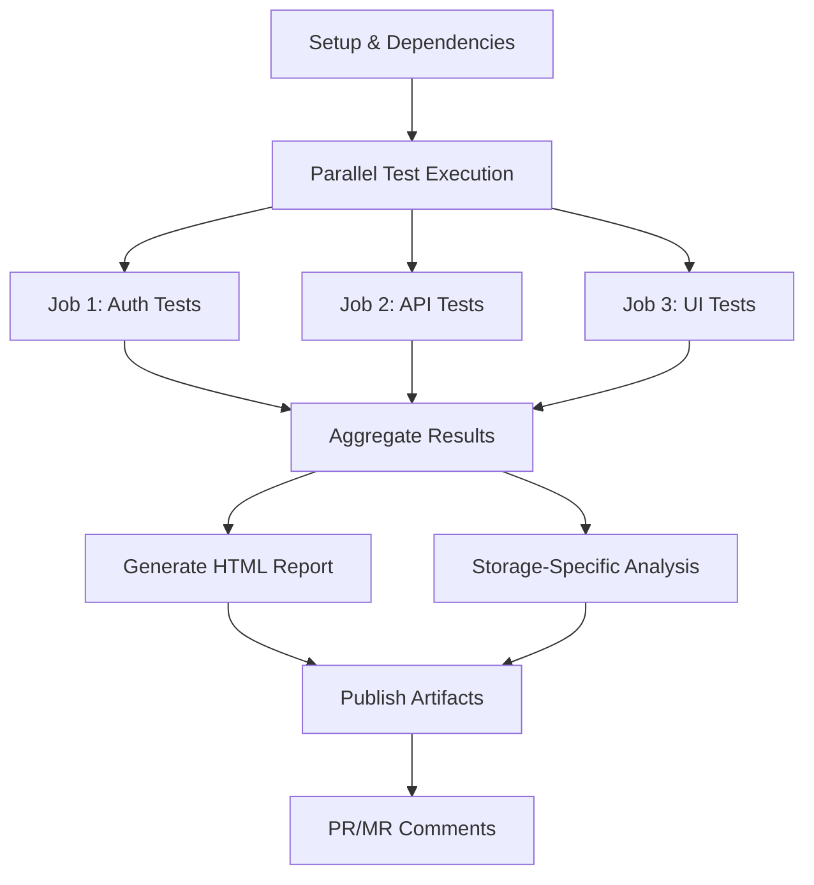

# CI/CD Pipeline Examples for perf-sentinel

This directory contains comprehensive CI/CD pipeline examples for integrating `perf-sentinel` into your existing continuous integration workflows. Each example demonstrates:

- **Parallel test execution** across multiple test suites
- **Multi-job performance data aggregation** 
- **Interactive HTML report generation**
- **Multiple storage adapter support** (FileSystem, S3, Database)
- **PR/MR comment integration**

## 🚀 Available Pipeline Examples

### 1. GitHub Actions (`github-actions.yml`)
Complete GitHub Actions workflow with:
- ✅ Parallel job execution (auth, api, ui)
- ✅ Job artifact collection and aggregation
- ✅ HTML report generation with GitHub artifacts
- ✅ PR comments with performance summaries
- ✅ S3 and Database storage variants
- ✅ Multi-environment support

### 2. Jenkins Pipeline (`jenkins-pipeline.groovy`)
Declarative Jenkins pipeline with:
- ✅ Parallel test execution with error handling
- ✅ Parameterized builds for flexibility
- ✅ HTML report publishing to Jenkins
- ✅ Email notifications with build results
- ✅ Storage adapter selection via parameters

### 3. GitLab CI/CD (`gitlab-ci.yml`)
GitLab CI pipeline with:
- ✅ YAML anchors for DRY configuration
- ✅ Conditional job execution based on variables
- ✅ GitLab Pages integration for report hosting
- ✅ Merge request comment integration
- ✅ Artifact management and cleanup

### 4. Azure DevOps (`azure-pipelines.yml`)
Azure DevOps pipeline with:
- ✅ Multi-stage pipeline architecture
- ✅ Azure DevOps HTML report integration
- ✅ Conditional job execution
- ✅ PR comment creation
- ✅ Build artifact management

## 📊 Pipeline Architecture

Each pipeline follows the same proven architecture:



### Phase 1: Parallel Test Execution
- **Job 1**: Authentication tests (`auth-tests-{build-id}`)
- **Job 2**: API tests (`api-tests-{build-id}`)
- **Job 3**: UI tests (`ui-tests-{build-id}`)

Each job:
1. Runs its specific test suite
2. Generates performance data via Cucumber hooks
3. Immediately analyzes results with `perf-sentinel analyze`
4. Publishes artifacts for aggregation

### Phase 2: Result Aggregation
- Collects results from all parallel jobs
- Uses `perf-sentinel aggregate` to combine data
- Generates comprehensive analysis across all suites

### Phase 3: Report Generation
- Creates interactive HTML reports
- Publishes reports as build artifacts
- Optionally hosts reports (GitLab Pages, Azure DevOps)

### Phase 4: Integration
- Posts PR/MR comments with performance summaries
- Sends notifications (email, Slack, etc.)
- Manages artifact lifecycle and cleanup

## 🔧 Setup Instructions

### Prerequisites
1. **Node.js 20+** installed in your CI environment
2. **perf-sentinel** added to your project dependencies
3. **Cucumber hooks** configured for performance data collection
4. **Test suites** organized by functionality (auth, api, ui, etc.)

### Configuration Files Required

#### 1. Package.json Scripts
```json
{
  "scripts": {
    "test:auth": "cucumber-js features/auth --require support/hooks.js",
    "test:api": "cucumber-js features/api --require support/hooks.js",
    "test:ui": "cucumber-js features/ui --require support/hooks.js"
  }
}
```

#### 2. Cucumber Hooks (support/hooks.js)
Use the enhanced Cucumber hooks from `examples/cucumber/hooks.js`:
- Collects rich context information
- Generates performance data with job IDs
- Saves results to `performance-results/latest-run.json`

#### 3. perf-sentinel Configuration
Create a CI-optimized configuration file:

```yaml
# examples/perf-sentinel-ci.yml
project:
  id: "${PROJECT_ID}"
  name: "My Web Application"

analysis:
  threshold: 1.8
  suite_overrides:
    authentication:
      threshold: 1.5
    api:
      threshold: 2.0
    ui:
      threshold: 2.2
  tag_overrides:
    "@critical":
      threshold: 1.3
    "@smoke":
      threshold: 1.6

reporting:
  default_reporters: ["console"]
  console:
    colors: false
    show_analysis_rules: false
```

### Environment Variables

#### Common Variables (All Platforms)
```bash
# Required
PROJECT_ID="my-web-app"

# Optional - Storage Adapters
MONGODB_CONNECTION_STRING="mongodb://localhost:27017"
S3_BUCKET_NAME="my-performance-bucket"
AWS_REGION="us-east-1"
```

#### Platform-Specific Variables

**GitHub Actions:**
```bash
# Secrets
MONGODB_CONNECTION_STRING  # MongoDB connection string
S3_BUCKET_NAME            # S3 bucket name
AWS_ACCESS_KEY_ID         # AWS access key
AWS_SECRET_ACCESS_KEY     # AWS secret key

# Variables
USE_S3_STORAGE=true       # Enable S3 storage variant
USE_DATABASE_STORAGE=true # Enable database storage variant
```

**Jenkins:**
```bash
# Credentials
mongodb-connection-string  # MongoDB connection string
s3-bucket-name            # S3 bucket name
aws-access-key-id         # AWS access key
aws-secret-access-key     # AWS secret key
```

**GitLab CI:**
```bash
# Variables
S3_BUCKET_NAME            # S3 bucket name
MONGODB_CONNECTION_STRING # MongoDB connection string
AWS_ACCESS_KEY_ID         # AWS access key
AWS_SECRET_ACCESS_KEY     # AWS secret key
```

**Azure DevOps:**
```bash
# Variables
S3_BUCKET_NAME            # S3 bucket name
MONGODB_CONNECTION_STRING # MongoDB connection string
AWS_ACCESS_KEY_ID         # AWS access key
AWS_SECRET_ACCESS_KEY     # AWS secret key
```

## 📈 Storage Adapter Options

### 1. FileSystem Adapter (Default)
**Best for**: Local development, small teams, getting started

```yaml
# Automatically used when no other storage is configured
storage:
  adapter_type: "filesystem"
  filesystem:
    base_directory: "./performance-results"
```

**Pros:**
- ✅ Zero setup required
- ✅ No external dependencies
- ✅ Fast and reliable
- ✅ Works offline

**Cons:**
- ❌ Limited scalability
- ❌ No multi-project support
- ❌ Repository size growth

### 2. S3 Adapter (Recommended for CI/CD)
**Best for**: CI/CD pipelines, medium to large teams

```bash
# Environment variables
export S3_BUCKET_NAME="my-performance-bucket"
export AWS_REGION="us-east-1"
export PROJECT_ID="my-web-app"

# Usage
npx perf-sentinel analyze \
  --run-file ./results.json \
  --bucket-name "$S3_BUCKET_NAME" \
  --project-id "$PROJECT_ID"
```

**Pros:**
- ✅ Scalable for large teams
- ✅ Multi-project support
- ✅ Built-in job coordination
- ✅ Cost-effective storage

**Cons:**
- ❌ Requires AWS setup
- ❌ Network dependency
- ❌ File management complexity

### 3. Database Adapter (Enterprise)
**Best for**: Large teams, analytics, high-frequency testing

```bash
# Environment variables
export MONGODB_CONNECTION_STRING="mongodb://localhost:27017"
export PROJECT_ID="my-web-app"

# Usage
npx perf-sentinel analyze \
  --run-file ./results.json \
  --db-connection "$MONGODB_CONNECTION_STRING" \
  --project-id "$PROJECT_ID"
```

**Pros:**
- ✅ Advanced analytics capabilities
- ✅ Concurrent access support
- ✅ Real-time dashboards
- ✅ Complex queries

**Cons:**
- ❌ Database setup required
- ❌ Higher complexity
- ❌ Network dependency

## 🛠️ Customization Guide

### Adding New Test Suites
1. **Create test scripts** in `package.json`:
   ```json
   {
     "scripts": {
       "test:reports": "cucumber-js features/reports --require support/hooks.js"
     }
   }
   ```

2. **Add pipeline job** for the new suite:
   ```yaml
   test-reports:
     runs-on: ubuntu-latest
     env:
       JOB_ID: "reports-tests-${{ github.run_id }}"
     steps:
       - run: npm run test:reports
       - run: npx perf-sentinel analyze --run-file ./performance-results/latest-run.json
   ```

3. **Update aggregation** job IDs:
   ```yaml
   JOB_IDS: "auth-tests-${{ github.run_id }},api-tests-${{ github.run_id }},ui-tests-${{ github.run_id }},reports-tests-${{ github.run_id }}"
   ```

### Custom Storage Configuration
Create environment-specific configurations:

```yaml
# perf-sentinel-production.yml
environments:
  production:
    analysis:
      threshold: 1.5
    storage:
      adapter_type: "database"
      database:
        connection: "${MONGODB_CONNECTION_STRING}"
        name: "perf-sentinel-prod"
```

### Custom Report Generation
Add custom reporters or modify HTML output:

```bash
# Generate multiple report formats
npx perf-sentinel analyze \
  --run-file ./aggregated-results.json \
  --reporter console markdown html \
  --html-output ./performance-report.html \
  --markdown-output ./performance-report.md
```

## 📝 Best Practices

### 1. Test Suite Organization
```
tests/
├── auth/           # Authentication tests
├── api/            # API integration tests
├── ui/             # UI/E2E tests
├── reports/        # Reporting functionality
└── admin/          # Admin panel tests
```

### 2. Performance Data Collection
- **Use consistent job IDs** across pipeline runs
- **Include rich context** in Cucumber hooks
- **Tag critical tests** with `@critical`, `@smoke`
- **Set appropriate timeouts** for long-running tests

### 3. CI/CD Configuration
- **Use secrets** for sensitive data (DB connections, API keys)
- **Set reasonable timeouts** for aggregation (10-15 minutes)
- **Archive artifacts** with appropriate retention policies
- **Handle failures gracefully** with `|| true` for test commands

### 4. Report Management
- **Publish HTML reports** as pipeline artifacts
- **Set artifact retention** based on team needs
- **Use descriptive artifact names** for easy identification
- **Include build/commit information** in reports

## 🔍 Troubleshooting

### Common Issues

#### 1. Job Aggregation Timeouts
**Problem**: `perf-sentinel aggregate` times out waiting for jobs
**Solution**: 
- Increase timeout values: `--timeout 900` (15 minutes)
- Check job naming consistency
- Verify storage adapter connectivity

#### 2. Missing Performance Data
**Problem**: No performance data collected from test runs
**Solution**:
- Verify Cucumber hooks are properly configured
- Check that `performance-results/latest-run.json` is generated
- Ensure test suites are running with the hooks

#### 3. Storage Adapter Issues
**Problem**: Cannot connect to S3 or database
**Solution**:
- Verify environment variables are set correctly
- Check network connectivity in CI environment
- Validate credentials and permissions

#### 4. HTML Report Generation Fails
**Problem**: HTML report is empty or malformed
**Solution**:
- Check that aggregated results contain data
- Verify `perf-sentinel analyze` command syntax
- Ensure sufficient disk space for report generation

### Debug Commands

```bash
# Test storage adapter connectivity
npx perf-sentinel analyze --run-file ./test-data.json --debug

# Verify job registration
npx perf-sentinel aggregate --job-ids "test-job" --debug --timeout 60

# Check configuration loading
npx perf-sentinel analyze --config ./perf-sentinel-ci.yml --debug
```

## 🎯 Performance Optimization

### Pipeline Optimization
- **Parallel execution**: Run test suites in parallel for faster feedback
- **Artifact caching**: Cache `node_modules` between jobs
- **Storage selection**: Choose appropriate storage adapter for your scale
- **Report generation**: Generate HTML reports only when needed

### Resource Management
- **Job timeout**: Set appropriate timeouts for each job type
- **Artifact retention**: Clean up old artifacts automatically
- **Memory limits**: Ensure adequate memory for large test suites
- **Network optimization**: Use regional storage for better performance

## 📚 Additional Resources

### Documentation
- [perf-sentinel README](../../README.md) - Main documentation
- [Configuration Guide](../../examples/perf-sentinel-ci.yml) - CI configuration
- [Cucumber Hooks](../../examples/cucumber/hooks.js) - Performance data collection

### Example Projects
- [Generate Large Dataset Report](../../examples/generate-large-dataset-report.js) - Demo script
- [Test Data](../../examples/test-data-large.json) - Sample performance data
- [Configuration Files](../../examples/) - Various configuration examples

### Support
- **Issues**: Report bugs and feature requests in the project repository
- **Discussions**: Join community discussions about performance monitoring
- **Documentation**: Contribute to documentation and examples

---

## 🚀 Quick Start

1. **Choose your CI/CD platform** and copy the appropriate pipeline file
2. **Configure secrets/variables** for your chosen storage adapter
3. **Add test suite scripts** to your `package.json`
4. **Update job IDs** in the aggregation step to match your test suites
5. **Commit and push** to trigger your first performance analysis pipeline

Your pipeline will automatically:
- ✅ Run tests in parallel
- ✅ Collect performance data
- ✅ Generate interactive HTML reports
- ✅ Post PR/MR comments with results
- ✅ Archive reports for future reference

**Happy performance monitoring!** 🎉 